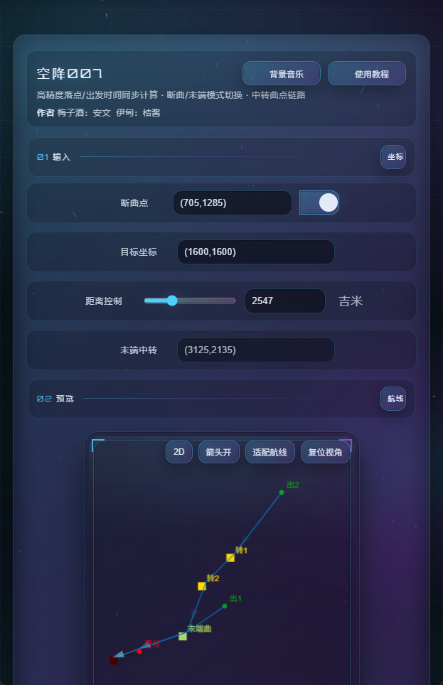

# Airborne Tool (Airborne 007)

A **front-end only**, plug-and-play web tool for **airdrop route / landing point / departure time** calculation and visualization.

- Supports **Cut-Point / End-Point** mode switching
- Supports **transfer (waypoint) chain**
- Route preview: **2D Canvas + 3D Three.js**
- 2D **zoom/pan**, one-click **2D/3D** toggle
- **Animated moving arrows** along routes (toggle on/off)
- Cyberpunk-style **two-stage intro animation** (skippable; respects `prefers-reduced-motion`)

> Note: This project is a static web page. It does **not** require any backend, and it does **not** upload your coordinates by default.

**Live demo:** [shenanwen.com/lss.html](http://shenanwen.com/lss.html)



---

## Features

- **Coordinate parsing & calculation**
  - Input multiple teams' start points, target point, cut point / end point, etc.
  - Calculate flight duration, departure time and related outputs
- **Route visualization**
  - **2D Mode**: Canvas-rendered route and key points
  - **2D Interaction**: mouse wheel zoom, drag-to-pan, `Fit Route` / `Reset View`
  - **3D Mode**: Three.js interactive preview (OrbitControls)
  - **Animated Arrows**: moving arrows along route direction (works in both 2D & 3D; can be disabled)
- **UX & compatibility**
  - Mobile / touch interaction adaptations
  - Respects `prefers-reduced-motion`
  - Runs locally; no network requests by default

---

## User Guide

### 1) How to open

- Recommended: use the live demo
  - [shenanwen.com/lss.html](http://shenanwen.com/lss.html)
- Offline usage / development:
  - Open `ls.html` directly.
- If you want to run it as a local “web service” (closer to production), use a static server (recommended commands below):

  - Python

    ```bash
    python -m http.server 8080 --bind 127.0.0.1
    ```

  - Node.js

    ```bash
    npx serve .
    ```

  Then open one of the following URLs:

  - `http://localhost:8080/ls.html`
  - `http://127.0.0.1:8080/ls.html`
  - `http://[::1]:8080/ls.html`

  > Note: if your terminal shows `http://[::]:8080/`, `[::]` is a wildcard *bind address* (for listening) and many browsers cannot use it directly as a destination URL.
  > Tip (Node.js): the port may not always be `8080`. Use the URL printed in your terminal (e.g. `http://localhost:3000/ls.html`).

  - (Optional) Access from phone / LAN devices:

    ```bash
    python -m http.server 8080 --bind 0.0.0.0
    ```

    Then open: `http://<YOUR_LAN_IP>:8080/ls.html`

### 2) Coordinate format

- Recommended format: `(x,y)`
  - Examples: `(705,1285)`, `(1600,1600)`
- Prefer ASCII punctuation (`,` `(` `)`) to avoid parsing issues with full-width Chinese symbols.

### 3) Input section (what to fill)

The input section is used to define the target and key route points, and to provide per-team start point parameters.

- **Cut point / End transfer toggle**
  - A switch decides which point is fixed.
  - Typical usage:
    - Fix the cut point: the tool derives the end transfer point.
    - Fix the end transfer point: the tool derives the cut point.
  - Choose the mode that matches your scenario.

- **Target coordinate**
  - The destination coordinate.

- **Distance control / other parameters**
  - Used to control distance/scale-related route parameters (see the unit shown on the page).

- **Multiple teams' start points**
  - Enter one start point per team.
  - If your build includes fields like team name / curvature:
    - Team name: used in result list and labels
    - Curvature: affects the route curvature and duration

- **Landing time**
  - Used to back-calculate each team’s departure time.

### 4) Results (view & copy)

- Results list shows key outputs per team (e.g., departure time, flight duration).
- **Copy**
  - Desktop: hover a result row to reveal copy actions.
  - Mobile / touch: tap a result row to reveal copy actions; tap blank space to hide.

### 5) Route preview (2D/3D)

By default, the page starts in **2D** preview mode.

- **2D/3D toggle**
  - The `2D/3D` button displays the current mode.

- **Animated arrows**
  - `Arrows On/Off`: toggles moving arrows along the route (affects both 2D & 3D).

- **Fit route / Reset view**
  - `Fit Route`: auto-zooms and centers the route.
  - `Reset View`: restores the default view.
  - Both buttons work in **2D and 3D**.

- **2D zoom & pan**
  - Mouse wheel: zoom
  - Mouse drag: pan

- **3D interaction**
  - Drag: rotate
  - Mouse wheel: zoom
  - Right/middle drag: pan (depends on browser/control settings)

### 6) FAQ

- **No results / no preview**
  - Check the coordinate format is `(x,y)`.
  - Ensure required fields are filled (target, cut/end point, at least one start point, landing time).

- **Buttons/copy not working on mobile**
  - Try a system browser or a WebView container with better compatibility.
  - If the issue persists, open an Issue with device model + OS version.

- **Too many effects / performance issues**
  - Disable route arrows.
  - Enable OS-level reduced motion (prefers-reduced-motion).

---

## Privacy

- **No network by default**: this tool runs as a static web page and performs calculations locally.
- If you add remote scripts/resources or convert it into a backend service, evaluate privacy/security impacts yourself.

---

## Disclaimer

- This project is for learning and communication.
- Outputs may vary depending on input data, algorithm assumptions, and game mechanics changes; use at your own risk.
- The authors are not responsible for any misuse.

---

## Contributing

Issues and PRs are welcome:

- Bug fixes
- UX improvements
- Animation/visualization enhancements
- Unit tests (if you later refactor into a modular project)

---

## License

Recommended options:

- **MIT** (permissive)
- **Apache-2.0** (includes patent clause)

You can pick a license template when creating the GitHub repository, or add a `LICENSE` file.
